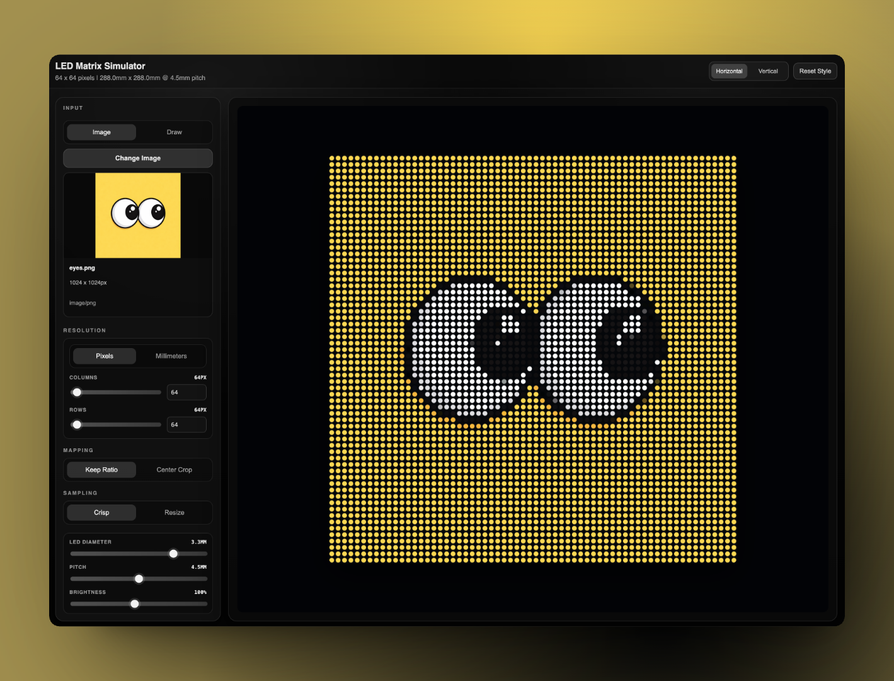
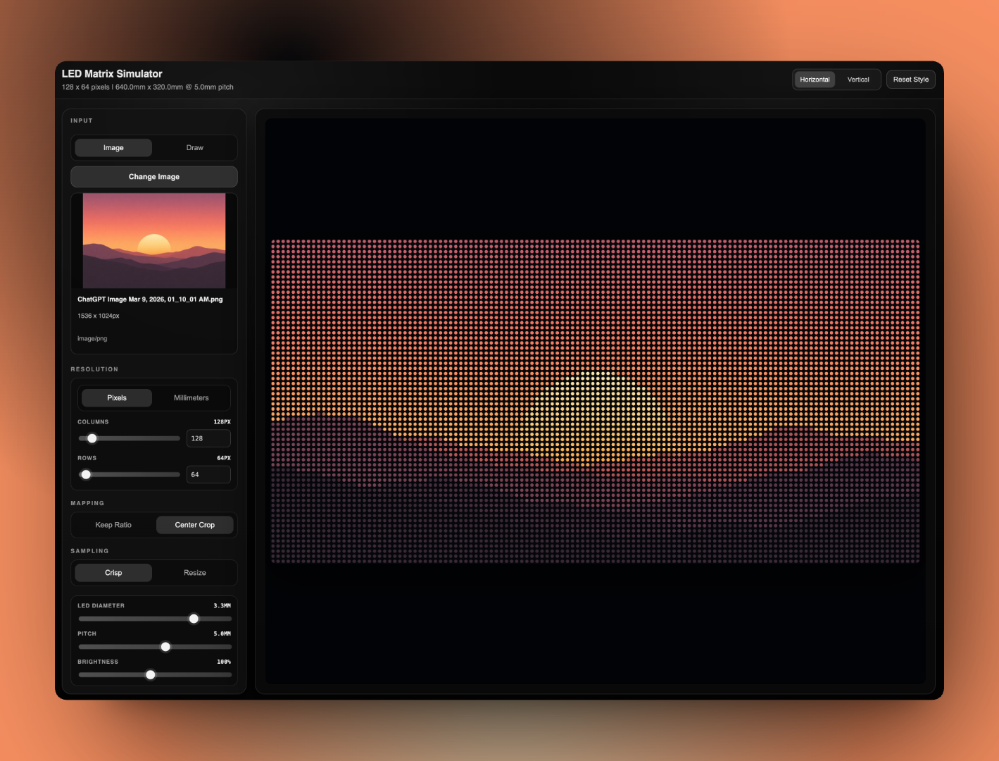

## LED Matrix Simulator

A browser-based LED matrix simulator for designing and previewing animations, pixel art, and image mappings on a virtual LED panel. Built with modern web tooling so you can experiment quickly without any hardware.



---

### Features

- **Interactive drawing panel**: Paint directly onto a virtual LED grid with configurable brush size and colors.
- **Image to matrix mapping**: Upload images and see how they would look on your LED matrix (with downscaling and color mapping).
- **Control panel**: Adjust matrix size, brightness, FPS, playback speed, and other simulation settings.
- **Animation preview**: Step through frames or play animations in real time on the simulated `LEDCanvas`.
- **Web-based**: Runs entirely in the browser via Vite – no hardware required, no installs for end users.

---

### Tech Stack

- **Frontend**: React (JSX)
- **Bundler / Dev Server**: Vite
- **Language**: JavaScript / JSX
- **Key components**: `LEDCanvas`, `DrawPanel`, `ImageUploader`, `ControlPanel`

---

### Getting Started

#### Prerequisites

- **Node.js** (LTS recommended)
- **npm** (comes with Node)

#### Quick Start (recommended)

From the project root:

```bash
./run-web.sh
```

This script:

- **Checks** that `npm` is installed  
- **Installs** dependencies if missing  
- **Starts** the app with the Vite dev server  

Then open the URL shown in your terminal (usually `http://localhost:5173`).

#### Manual Run

From the project root:

```bash
npm install
npm run dev
```

Then open the printed local URL in your browser.

---

### Usage

- **Draw mode**
  - Use the drawing tools in `DrawPanel` to paint pixels onto the virtual matrix.
  - Change colors, brush size, and clear or reset the panel from the control panel.
- **Image upload**
  - Switch to the image upload panel (`ImageUploader`).
  - Upload an image; it will be automatically resized and mapped to the current matrix size.
  - Tweak settings (size, brightness, etc.) to see how it would appear on a physical matrix.
- **Playback & animation**
  - Use the `ControlPanel` to play/pause, step through frames, and adjust animation speed.
  - Preview how sequences of frames will look in real time on `LEDCanvas`.

---

### Project Structure (high-level)

- **`pages/Simulator.jsx`**: Main simulator page wiring together all LED components.
- **`components/led/LEDCanvas.jsx`**: Core rendering logic for the LED grid.
- **`components/led/DrawPanel.jsx`**: UI for drawing and editing frames.
- **`components/led/ImageUploader.jsx`**: Handles image uploads and mapping to the matrix.
- **`components/led/ControlPanel.jsx`**: Global controls (size, brightness, playback, etc.).

---

### Contributing

Contributions and ideas are welcome:

- **Bug reports**: Please include steps to reproduce and your environment.
- **Feature requests**: Describe your use case (for example, “export frames as JSON for microcontroller X”).
- **Pull requests**: Keep changes focused and include a brief summary in the PR description.

---

### License

Specify your license here. For example:

> MIT License – feel free to use, modify, and share, with attribution.
